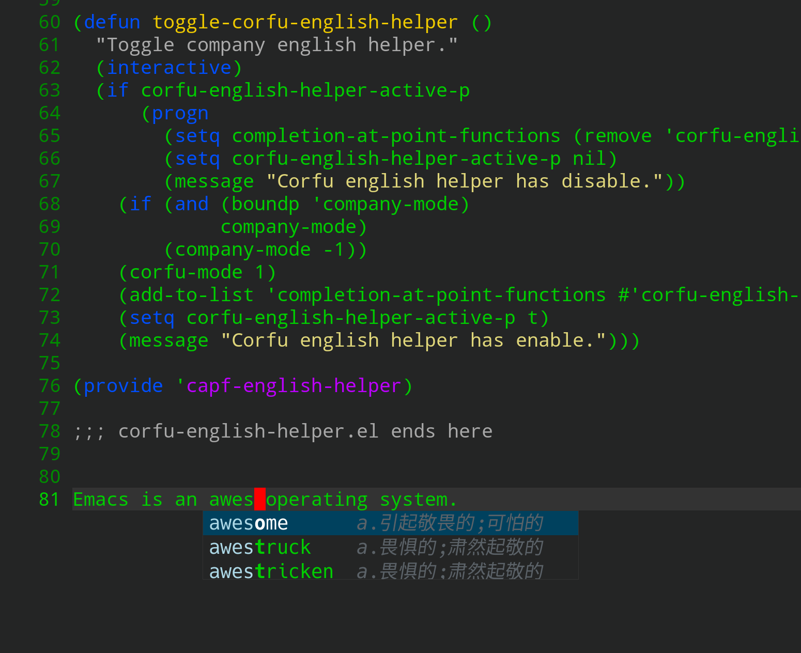

## What is corfu-english-helper ?
corfu-english-helper is english writing assistant, help me complete English word.

This plugin base on fantastic completion framework [Corfu](https://github.com/minad/corfu)



## Install
1. Download corfu-english-helper:

```Bash
git clone --depth=1 -b master https://github.com/manateelazycat/corfu-english-helper.git ~/.emacs.d/site-lisp/corfu-english-helper/
```

2. Add corfu-english-helper to ```load-path```:
```Elisp
(add-to-list 'load-path "~/.emacs.d/site-lisp/corfu-english-helper/")
(require 'corfu-english-helper)
```

## Usage
* ```toggle-corfu-english-helper```: toggle on english helper, write english on the fly.
* ```corfu-english-helper-search```: popup english helper manually


## Customize your own dictionary.
Default english dictionary is generate from stardict KDict dictionary with below command

```Shell
python ./stardict.py stardict-kdic-ec-11w-2.4.2/kdic-ec-11w.ifo
```

You can replace with your favorite stardict dictionary's info filepath to generate your own corfu-english-helper-data.el .

# Acknowledgements
I create [company-english-helper](https://github.com/manateelazycat/company-english-helper), this package is port to corfu-mode, most code of corfu version is written by [theFool32](https://github.com/theFool32).
